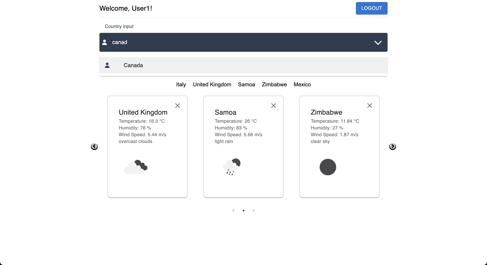

#Mira la aplicacion aqui: 
#https://weatherapp-woad-rho.vercel.app/

# Weather App

This project is a simple weather application built with React and TypeScript.

## Getting Started

### Prerequisites

- Node.js (v16+)
- npm or yarn

### Installation

1. Clone the repository:
   ```bash
   git clone https://github.com/AdolfoCBasilio/weatherapp.git

2. Install dependencies:
   ```bash
   npm install
   ```
   or
   ```bash
   yarn install
   ```
### Running the Application

3. To start the application, run:
   ```bash
   npm start
   ```
   or
   ```bash
   yarn start
   ```
### Design and Architecture
The application follows a modular architecture with the following main components:

- **api/**: Contains the service for fetching weather data.
- **components/**: Reusable UI components.
- **context/**: Context API for managing the global state.
- **hooks/**: Custom hooks for managing logic.
- **pages/**: Main application pages.
- **styles/**: Global styles.

### Technologies Used

- React
- TypeScript
- Material-UI
- Axios
- React-Router-Dom
- Context API
- Custom Hooks
- OpenWeatherMap API
- LocalStorage
- Responsive Design
- Error Handling

### Features

- Integration with backend API to obtain weather data
- Responsive design
- Search for weather by city
- Simple user authentication with local storage
- View current temperature, humidity, and wind speed

### License

This project is licensed under the MIT License.

### Screenshots




### Contact
You can reach me at: [ [email]( adolfocbasilio@gmail.com ) ] or [ [LinkedIn](https://www.linkedin.com/in/adolfocbg/) ]
